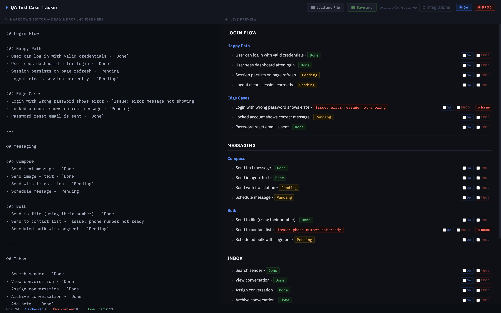

# QA Test Case Tracker

A lightweight, zero-install markdown-based test case tracker with per-environment checkboxes for QA and Production.

No server. No login. No database. Just open the HTML file in your browser.



---

## Features

- **Live markdown editor** — write test cases in plain markdown, preview updates instantly
- **QA + PROD checkboxes** — every test item gets two independent checkboxes, one per environment
- **Status color coding**
  - 🟢 `` `Done` `` → green
  - 🟡 `` `Pending` `` → yellow
  - 🔴 `` `Issue...` `` or `` `Error...` `` → red
  - Everything else → gray
- **Load .md file** — open any `.md` file directly from your machine
- **Drag & drop** — drag a `.md` file onto the editor panel
- **Save .md** — download your edited markdown back to disk
- **Stats bar** — live count of total items, QA checked, Prod checked, and Done items
- **Zero dependencies** — single HTML file, works fully offline (uses CDN for fonts/marked.js on first load)

---

## Usage

### Option 1 — Direct (no install)
1. Download `index.html`
2. Double-click to open in Chrome, Edge, or Firefox
3. Load your `.md` file or paste markdown into the editor

### Option 2 — Clone the repo
```bash
git clone https://github.com/YOUR_USERNAME/qa-tracker.git
cd qa-tracker
open index.html   # macOS
start index.html  # Windows
```

---

## Markdown Format

Write your test cases as regular markdown lists. Use backtick-wrapped status tags inline:

```markdown
## Login Flow

### Happy Path
- User can log in with valid credentials - `Done`
- User sees dashboard after login - `Done`
- Session persists on page refresh - `Pending`

### Edge Cases
- Login with wrong password shows error - `Issue: error message not showing`
- Locked account shows correct message - `Pending`

## API
- POST /auth returns 200 on success - `Done`
- POST /auth returns 401 on bad credentials - `Error: returning 500 instead`
```

---

## Status Tags

| Tag | Color | When to use |
|-----|-------|-------------|
| `` `Done` `` | 🟢 Green | Test passed |
| `` `Pending` `` | 🟡 Yellow | Not yet tested |
| `` `Issue: ...` `` | 🔴 Red | Bug found |
| `` `Error: ...` `` | 🔴 Red | Error encountered |
| Anything else | ⬜ Gray | Notes, context |

---

## Keyboard Tips

| Action | How |
|--------|-----|
| Load file | Click **Load .md File** button or drag & drop |
| Save file | Click **Save .md** — keeps original filename |
| New test case | Type `- your test case` in the editor |
| Mark status | Add `` `Done` `` or `` `Pending` `` at the end of the line |

---

## Tech Stack

| | |
|---|---|
| Runtime | Plain HTML + CSS + JS — no framework |
| Markdown parsing | [marked.js](https://marked.js.org/) v9 via CDN |
| Fonts | IBM Plex Mono + IBM Plex Sans via Google Fonts |
| Storage | In-memory only (checkbox state resets on page reload) |

---

## Roadmap / Ideas

PRs welcome for:

- [ ] LocalStorage persistence (checkbox state survives refresh)
- [ ] Export to CSV / PDF report
- [ ] Dark / light theme toggle
- [ ] Multiple test suite tabs
- [ ] Filter view: show only Pending / Issue items
- [ ] Keyboard shortcut to toggle QA / PROD checkbox

---

## Contributing

1. Fork the repo
2. Make your changes to `index.html`
3. Open a PR with a short description of what you changed

This is intentionally a single-file tool. Please keep it that way — no build steps, no npm, no frameworks.

---

## License

MIT — free to use, modify, and distribute.
